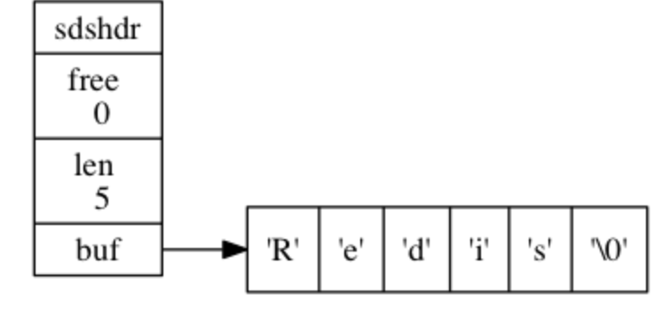

## Redis简单动态字符串
Redis 没有直接使用 C 语言传统的字符串表示（以空字符结尾的字符数组，以下简称 C 字符串）， 而是自己构建了一种名为简单动态字符串（simple dynamic string，SDS）的抽象类型，
并将 SDS 用作 Redis 的默认字符串表示。

### SDS 的定义
每个 sds.h/sdshdr 结构表示一个 SDS 值：
```c
struct sdshdr {

    // 记录 buf 数组中已使用字节的数量
    // 等于 SDS 所保存字符串的长度
    int len;

    // 记录 buf 数组中未使用字节的数量
    int free;

    // 字节数组，用于保存字符串
    char buf[];

};
```
一个 SDS 示例：

- free 属性的值为 0 ， 表示这个 SDS 没有分配任何未使用空间。
- len 属性的值为 5 ， 表示这个 SDS 保存了一个五字节长的字符串。
- buf 属性是一个 char 类型的数组， 数组的前五个字节分别保存了 'R' 、 'e' 、 'd' 、 'i' 、 's' 五个字符， 而最后一个字节则保存了空字符 '\0' 。



SDS 遵循 C 字符串以空字符结尾的惯例， 保存空字符的 1 字节空间不计算在 SDS 的 len 属性里面， 并且为空字符分配额外的 1 字节空间， 以及添加空字符到字符串末尾等操作都是由 SDS 函数自动完成的， 所以这个空字符对于 SDS 的使用者来说是完全透明的。

遵循空字符结尾这一惯例的好处是， SDS 可以直接重用一部分 C 字符串函数库里面的函数。

### SDS的优点
1. 常数复杂度获取字符串长度

2. 杜绝缓冲区溢出

3. 减少修改字符串时带来的内存重分配次数

4. 二进制安全

5. 兼容部分 C 字符串函数

#### 总结

| C字符串 | SDS |
| ------ | ------ |
| 获取字符串长度的复杂度为 O(N) 。 | 获取字符串长度的复杂度为 O(1) 。 |
| API 是不安全的，可能会造成缓冲区溢出。 | API 是安全的，不会造成缓冲区溢出。 |
| 修改字符串长度 N 次必然需要执行 N 次内存重分配。 | 修改字符串长度 N 次最多需要执行 N 次内存重分配。 |
| 只能保存文本数据。 | 可以保存文本或者二进制数据。 |
| 可以使用所有 <string.h> 库中的函数。 | 可以使用一部分 <string.h> 库中的函数。 |

## 参考
《Redis设计与实现》
